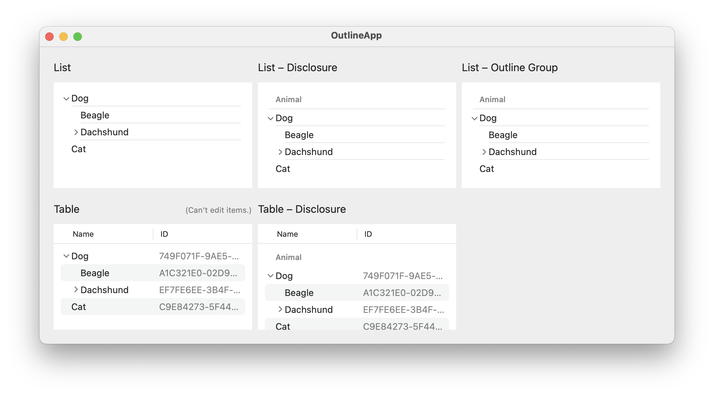

# Outline App

Sample app to demonstrate various implementations of editable outline view using SwiftUI
for the panel discussion about outline views in the [macOS native Symposium #10](https://macos-native.github.io).

- related presentation deck: [Outline View in SwiftUI– Speaker Deck](https://speakerdeck.com/1024jp/outline-view-in-swiftui) (in Japanese)

## Development Environment

- macOS 15.1 Sequoia
- Xcode 16.1
- Swift 6
- Sandbox and hardened runtime enabled

## License

© 2024 1024jp

The source code is licensed under the terms of the __MIT license__. See [LICENSE](LICENSE) for details.
